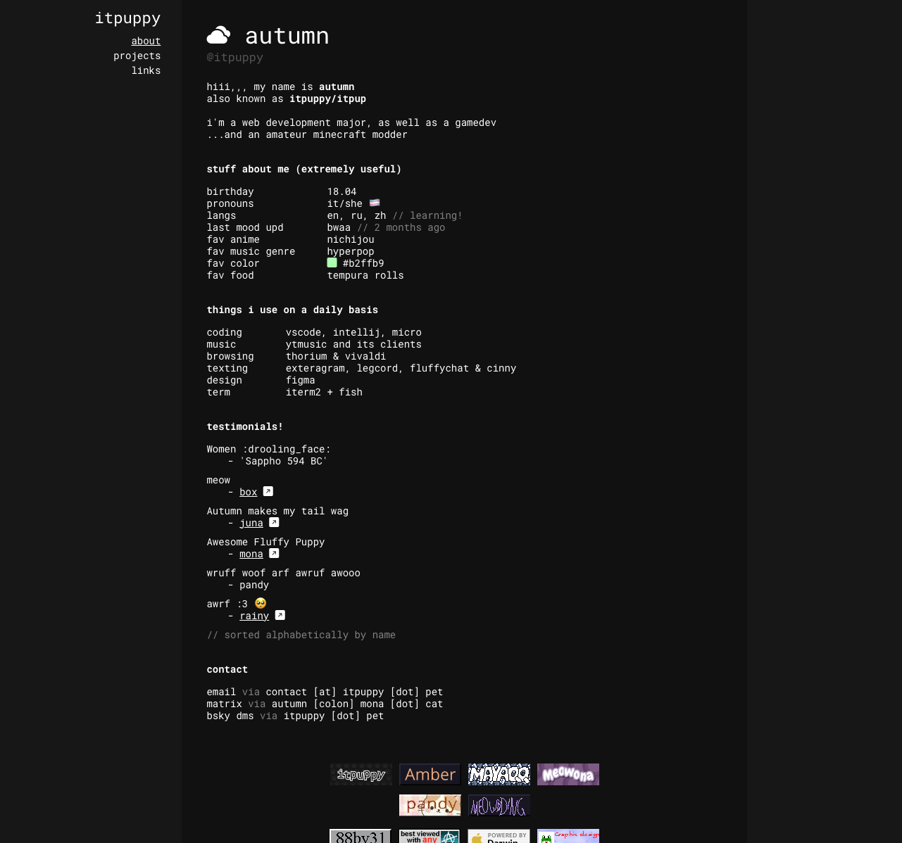

# 🐾 autumn's personal homepage

    small silly homepage hosted using CF Pages
    contains reactivity implemented using alpine.js

## 🐾 third party libraries

**alpine.js**\
licensed under the **MIT License**

**bootstrap icons**\
licensed under the **MIT License**
